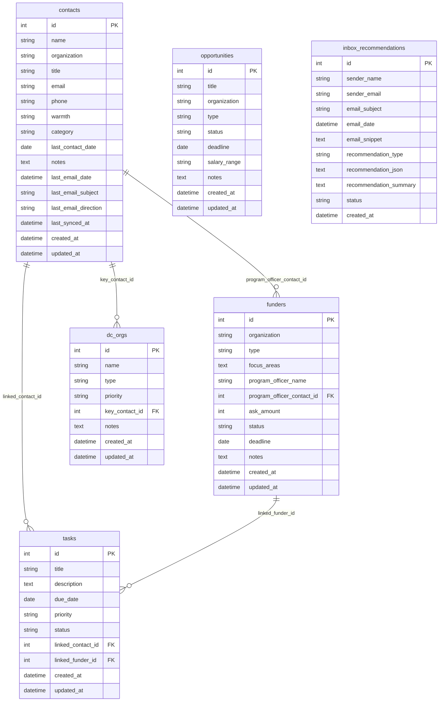

# Data Model



## Field notes

**contacts**
- `warmth` — `cold | warm | hot` (manually set)
- `category` — `advocacy | funder | government | media | peer_org | dc_network | other`
- `last_email_*` / `last_synced_at` — written by `gmail_sync.py`; never edited manually

**funders**
- `status` — `research | identified | outreach | meeting_scheduled | proposal_submitted | funded | declined | dormant`
- `program_officer_contact_id` — optional FK to contacts; the same person may appear in both tables

**tasks**
- `priority` — `low | medium | high`
- `status` — `pending | done`
- Can be linked to a contact, a funder, both, or neither

**inbox_recommendations**
- `recommendation_type` — `new_contact | new_task`
- `recommendation_json` — JSON object with Claude-suggested field values, used to pre-fill the Inbox tab form
- `status` — `pending | accepted | dismissed`; accepted rows trigger a contact or task insert
```
