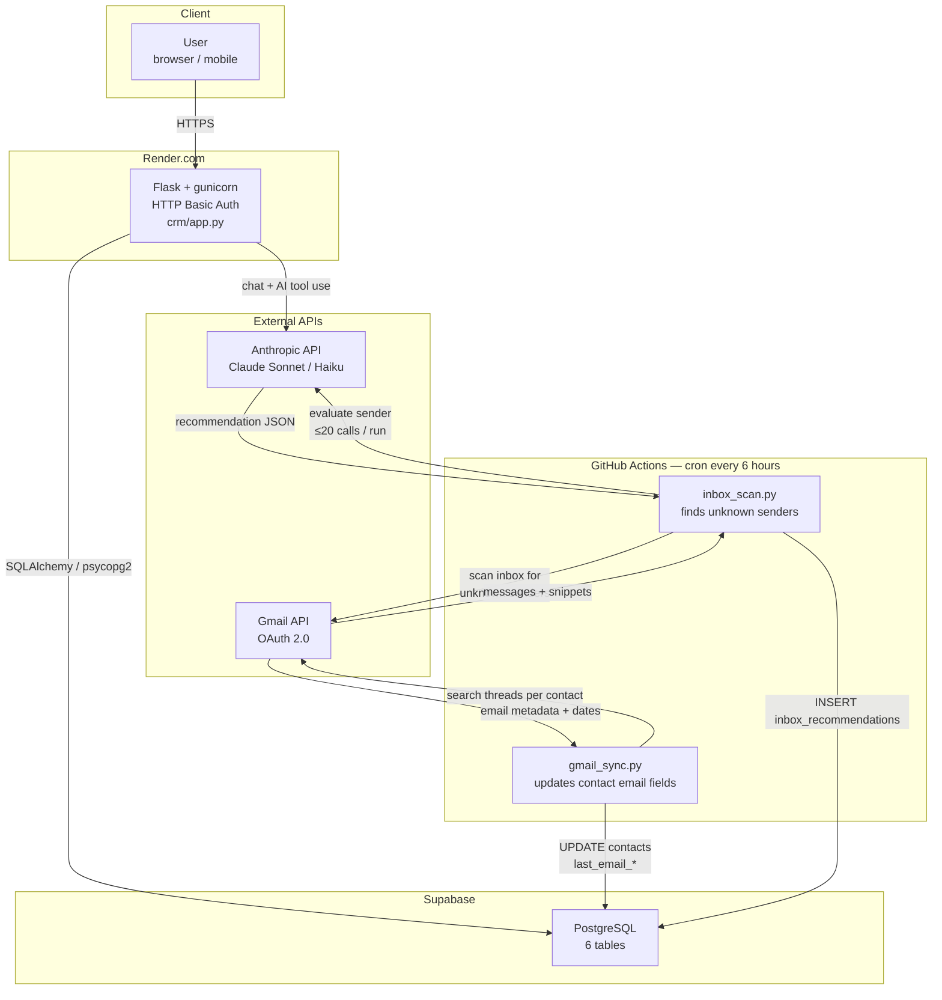

# System Architecture



## Component notes

| Component | Role |
|---|---|
| **Render.com** | Hosts the Flask web app. `DATABASE_URL` injected as env var. Auto-deploys on push to `main`. |
| **Supabase** | Managed PostgreSQL. Schema created via `init_db()` on startup + SQL migrations in `crm/migrations/`. |
| **gmail_sync.py** | Runs every 6 h. For each contact with an email address, finds the most recent thread and writes `last_email_date`, `last_email_subject`, `last_email_direction`, `last_synced_at`. |
| **inbox_scan.py** | Runs every 6 h after `gmail_sync.py`. Scans inbox for senders not in the contacts table, filters automated senders, calls Claude Haiku (≤ 20 calls, ~$0.02 max per run) to evaluate each, saves `pending` recommendations. |
| **Inbox tab** | Web UI review queue — Accept creates the contact/task, Dismiss marks dismissed. |
| **Chat tab** | Claude Sonnet with tool use — describe a meeting in plain English and it updates contact records, creates tasks, and drafts emails. |
```
